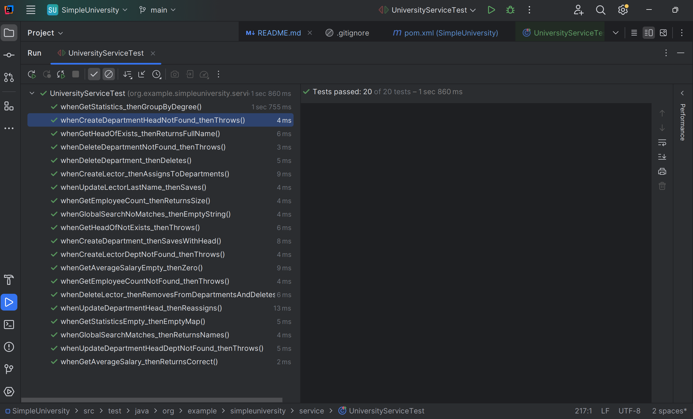

# SimpleUniversity Console Application

A simple Spring Boot console application to manage a university’s departments and lectors. Lectors can work in multiple departments and have one of three degrees: **ASSISTANT**, **ASSOCIATE_PROFESSOR**, or **PROFESSOR**. All data is stored in a relational database (PostgreSQL by default).

## Table of Contents

- [Supported Commands](#supported-commands)
  - [Stats](#stats)
  - [Create](#create)
  - [Update](#update)
  - [Delete](#delete)
  - [List](#list)
  - [Exit](#exit)
- [Getting Started](#getting-started)
  - [Prerequisites](#prerequisites)
  - [Database Setup](#database-setup)
  - [Configuration](#configuration)
- [Usage & Examples](#usage--examples)
  - [Query Commands](#query-commands)
  - [Create Commands](#create-commands)
  - [Update Commands](#update-commands)
  - [Delete Commands](#delete-commands)
  - [List Commands](#list-commands)
- [Mocking](#mocking)
- [Test Cases and Their Purpose](#test-cases-and-their-purpose)
- [Exit](#exit-1)

## Supported Commands

- **Stats**  
  - who is head of department `{departmentName}`
  - show `{departmentName}` statistics 
  - show the average salary for the department `{departmentName}`  
  - show count of employee for `{departmentName}`  
  - global search by `{template}`  

- **Create**  
  - add department `{departmentName}` head `{lectorKey}`  
  - add lector `{firstName}` `{lastName}` degree `{ASSISTANT | ASSOCIATE_PROFESSOR | PROFESSOR}` salary `{salary}` `[departments dept1,dept2,…]`  

- **Update**  
  - update department `{deptKey}` head `{newHeadKey}`  
  - update lector `{lectorKey}` `{field}` `{newValue}`  

- **Delete**  
  - delete department `{deptKey}`  
  - delete lector `{lectorKey}`  

- **List**  
  - list departments
  - list lectors 

- **Exit**  
  - exit

---

## Getting Started

### Prerequisites

- **Java 17** or higher  
- **Maven 3.6+**  
- **PostgreSQL** (or another JDBC-compatible RDBMS)

### Database Setup

#### 1. Create the database

```bash
psql -U postgres
CREATE DATABASE university;
\q
```


### Configuration

Edit `src/main/resources/application.properties`:

```properties
spring.application.name=SimpleUniversity

spring.datasource.url=jdbc:postgresql://localhost:5432/university
spring.datasource.username=postgres
spring.datasource.password=your_password
spring.datasource.driver-class-name=org.postgresql.Driver

spring.jpa.hibernate.ddl-auto=update
spring.jpa.properties.hibernate.dialect=org.hibernate.dialect.PostgreSQLDialect
```

> **Note**: replace `postgres` and `your_password` with your actual PostgreSQL username and password.

> **Note**: replace `university` with your actual PostgreSQL DB name.

---

## Usage & Examples

### Query Commands

* **Who is head of department**

  ```text
  who is head of department Physics
  ```
  
  > Head of Physics department is Albert Einstein

* **Show department statistics**

  ```text
  show Mathematics statistics
  ```

  > assistants - 2
  > 
  > associate professors - 1
  > 
  > professors - 0
  

* **Show average salary**

  ```text
  show the average salary for the department Physics
  ```

  > The average salary of Physics is 6233.33

* **Show employee count**

  ```text
  show count of employee for Chemistry
  ```

  > 3

* **Global search by name fragment**

  ```text
  global search by van
  ```

  > Ivan Petrenko, Petro Ivanov

---

### Create Commands

* **Add a new department**

  ```text
  add department CS head 3
  add department History head "Jane Smith"
  ```

  > Department created.

* **Add a new lector**

  ```text
  add lector Alice Johnson degree ASSISTANT salary 5000
  add lector Bob Lee degree PROFESSOR salary 8000 departments Physics,Mathematics
  ```

  > Lector created.

---

### Update Commands

* **Change a department’s head**

  ```text
  update department CS head 2
  update department Physics head "Albert Einstein"
  ```

  Department head updated.

* **Update a lector’s field**

  ```text
  update lector 5 salary 9000
  update lector "Alice Johnson" degree ASSOCIATE_PROFESSOR
  update lector Bob Lee departments CS,History
  ```

  Lector updated.

---

### Delete Commands

* **Delete a department**

  ```text
  delete department History
  ```

  > Department deleted.

* **Delete a lector**

  ```text
  delete lector 7
  ```

  > Lector deleted.

---

### List Commands

* **List all departments**

  ```text
  list departments
  ```

  > id=1 name=Physics head=Albert Einstein
  > 
  > id=2 name=Mathematics head=John Doe


* **List all lectors**

  ```text
  list lectors
  ```

  > id=1 John Doe ASSOCIATE_PROFESSOR salary=5000.00
  > 
  > id=2 Jane Smith ASSISTANT salary=4500.00

---

## Mocking

Mocking is a unit–testing technique where real dependencies (e.g., repositories or external services) are replaced with “fake” objects that return predictable data. This allows you to:

- **Isolate** your service logic from the database or other external systems.  
- **Speed up** tests by running everything in memory.  
- **Ensure determinism**: you know exactly what data your mocks will return.

### Example in IntelliJ IDEA

> **Screenshot suggestion**:  
> 1. The `UniversityServiceTest.java` file showing `@Mock` and `@InjectMocks` annotations.  
> 2. The green test-run bar in the Run panel confirming all 20 tests passed.




---

## Test Cases and Their Purpose

| No. | Test Name                                               | Method Under Test      | Scenario                           | Expected Result                                                 |
| --- | ------------------------------------------------------- | ---------------------- | ---------------------------------- | --------------------------------------------------------------- |
| 1   | `whenGetHeadOfExists_thenReturnsFullName`               | `getHeadOf`            | Department exists                  | Returns the full name of the head                               |
| 2   | `whenGetHeadOfNotExists_thenThrows`                     | `getHeadOf`            | Department not found               | Throws `IllegalArgumentException`                               |
| 3   | `whenGetStatistics_thenGroupByDegree`                   | `getStatistics`        | Two lectors with different degrees | Map counting each `Degree`                                      |
| 4   | `whenGetStatisticsEmpty_thenEmptyMap`                   | `getStatistics`        | No lectors                         | Returns an empty map                                            |
| 5   | `whenGetAverageSalary_thenReturnsCorrect`               | `getAverageSalary`     | Known salaries for two lectors     | Correct average salary                                          |
| 6   | `whenGetAverageSalaryEmpty_thenZero`                    | `getAverageSalary`     | No lectors                         | Returns `0.0`                                                   |
| 7   | `whenGetEmployeeCount_thenReturnsSize`                  | `getEmployeeCount`     | Three unique lectors               | Returns `3`                                                     |
| 8   | `whenGetEmployeeCountNotFound_thenThrows`               | `getEmployeeCount`     | Department not found               | Throws `IllegalArgumentException`                               |
| 9   | `whenGlobalSearchMatches_thenReturnsNames`              | `globalSearch`         | Multiple name matches              | Comma–separated list of full names                              |
| 10  | `whenGlobalSearchNoMatches_thenEmptyString`             | `globalSearch`         | No matches                         | Returns an empty string                                         |
| 11  | `whenCreateDepartment_thenSavesWithHead`                | `createDepartment`     | Existing lector as head            | Department saved with correct head                              |
| 12  | `whenCreateDepartmentHeadNotFound_thenThrows`           | `createDepartment`     | Head not found                     | Throws `IllegalArgumentException`                               |
| 13  | `whenUpdateDepartmentHead_thenReassigns`                | `updateDepartmentHead` | Replace old head with new head     | New head set, old removed from department                       |
| 14  | `whenUpdateDepartmentHeadDeptNotFound_thenThrows`       | `updateDepartmentHead` | Department not found               | Throws `IllegalArgumentException`                               |
| 15  | `whenDeleteDepartment_thenDeletes`                      | `deleteDepartment`     | Department exists                  | Invokes `delete(...)` on repository                             |
| 16  | `whenDeleteDepartmentNotFound_thenThrows`               | `deleteDepartment`     | Department not found               | Throws `IllegalArgumentException`                               |
| 17  | `whenCreateLector_thenAssignsToDepartments`             | `createLector`         | New lector in two departments      | `save` called for lector and each department                    |
| 18  | `whenCreateLectorDeptNotFound_thenThrows`               | `createLector`         | One invalid department key         | Throws `IllegalArgumentException`                               |
| 19  | `whenUpdateLectorLastName_thenSaves`                    | `updateLector`         | Change `lastname` field            | Lector’s last name updated and `save(...)` invoked              |
| 20  | `whenDeleteLector_thenRemovesFromDepartmentsAndDeletes` | `deleteLector`         | Remove lector from all departments | Lector removed from each department’s list and `delete` invoked |

### Exit

```text
exit
```

---